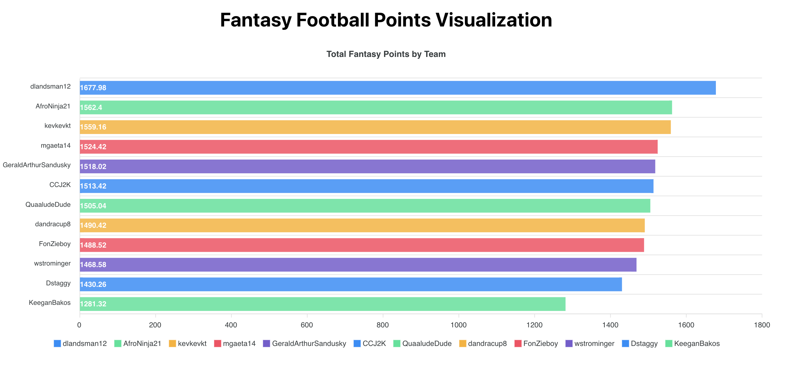

# How to use the Sleeper API

## Introduction

Last year I built [ffwrapped](https://ffwrapped.com/), an open source website that provides fantasy football league insights and analysis. This project was made possible by the free, public [Sleeper API](https://docs.sleeper.com/). If you're curious about accessing detailed information about your leagues, the Sleeper API offers comprehensive data - all without any authentication required. After working with this API for over a year and building a full-fledged app, I want to share how anyone can create their own project. For this tutorial, we’re going to make a simple bar chart that shows the total points scored by each league member.

## 1. Setup Your Project

For this project, we're only going to need league and roster data but
the Sleeper API provides access to much more, including: transactions, users, matchups, player points, and draft data. To get started, I recommend using [Vite](https://vite.dev/), a popular build tool. For more detailed instructions, take a look at their getting started [guide](https://vite.dev/guide/). I'll show you how to scaffold a simple project.

Run the following commands in your terminal of choice.

```bash
# Create a new Vite project with React
npm create vite@latest fantasy-football-app -- --template react

# Navigate to the project directory
cd fantasy-football-app

# Install dependencies
npm install

# Install additional packages we'll need
npm install apexcharts react-apexcharts
```

For ffwrapped, I used Vue and TypeScript, but any frontend framework will work. For this tutorial, I'll use React because it's the most popular framework and most developers are already familiar with it.

## 2. Create Your Visualization Component

Create a file called `PointsGraph.jsx` in the `src` folder.

To start, we need to import the `useState` and `useEffect` hooks from react and then for the bar graph, we’re going to use the [apexcharts](https://www.apexcharts.com/docs/installation/) library. The `PointsGraph` component accepts `leagueId` as props which we'll pass in when we update `App.jsx`. We'll also setup three `useState` values to handle the data, loading state, and error state.

- chartData: Stores the formatted data for the chart. Initially set to null, and updated with the team names and points after fetching the API data.
- isLoading: Tracks whether the API request is still in progress. Starts as true, and switches to false when the data finishes loading or an error occurs.
- error: Holds any error message in case the API request fails. If there’s no error, this stays null.

```jsx
import { useState, useEffect } from "react";
import Chart from "react-apexcharts";

const PointsGraph = ({ leagueId }) => {
  const [chartData, setChartData] = useState(null); // values to pass into the apexchart
  const [isLoading, setIsLoading] = useState(true); // loading state when data is being fetched
  const [error, setError] = useState(null); // error state if there is an error when fetching data

  return <div></div>;
};
```

To retrieve the data we need from Sleeper, we can use the fetch API and store the responses in variables `usersResponse` and `rostersResponse`. Since fetching data is a side effect, we need to use the `useEffect` hook. We want the component
to remount whenever `leagueId` changes so we can set the dependency array to `[leagueId]`.

```jsx
useEffect(() => {
  const fetchData = async () => {
    try {
      // Fetch league users and rosters
      const [usersResponse, rostersResponse] = await Promise.all([
        fetch(`https://api.sleeper.app/v1/league/${leagueId}/users`).then(
          (res) => res.json()
        ),
        fetch(`https://api.sleeper.app/v1/league/${leagueId}/rosters`).then(
          (res) => res.json()
        ),
      ]);
    } catch (err) {
      console.error("Error fetching data:", err);
      setError("Failed to load league data");
    } finally {
      setIsLoading(false);
    }
  };
  fetchData();
}, [leagueId]); // run every time leagueId changes
```

To make things easier, we can take `usersResponse` and map the `user_id` from each user and to their `display_name`. We need the mapping to connect each user’s total points from the rosters response to their user name. This should also be done in the `try` block to catch any errors.

```jsx
// Create user map for easy lookup
const userMap = {};
usersResponse.forEach((user) => {
  userMap[user.user_id] = user.display_name;
});
```

We can then map through `rostersResponse` and get the data in the format we need. `teamData` here is an array of objects where each object has a `teamName` and `points` value. The array values are then sorted by points, from highest to lowest.

Finally, we can take `teamData` and use `setChartData` to update the `chartData` state. `chartData` can then be used in `chartOptions` where we’ll set the configuration for our `apexcharts` bar graph.

```jsx
// Format data into [{teamName: '', points: ''}...]
const teamData = rostersResponse.map((roster) => {
  const teamName = userMap[roster.owner_id];
  const points = roster.settings.fpts + roster.settings.fpts_decimal / 100;

  return {
    teamName,
    points,
  };
});
// Sort by points (highest first)
teamData.sort((a, b) => b.points - a.points);

// Prepare data for ApexCharts
setChartData({
  teams: teamData.map((team) => team.teamName),
  points: teamData.map((team) => parseFloat(team.points.toFixed(2))),
});
```

Outside of the `useEffect`, we’ll have to configure our `chartOptions`. Inside of this object, we can use the `chartData` state we just updated in the previous step. `chartData.points` will be used for the series data and `chartData.teams` is needed for the x-axis categories. The remaining options can remain default, but feel free to check out the apexcharts [documentation](https://apexcharts.com/docs/series/) for further customizations.

```jsx
const chartOptions = {
  chart: {
    type: "bar",
    height: 500,
    toolbar: {
      show: false,
    },
  },
  plotOptions: {
    bar: {
      horizontal: true,
      distributed: true,
      dataLabels: {
        position: "bottom",
      },
    },
  },
  series: [
    {
      name: "Total Points",
      data: chartData.points,
    },
  ],
  xaxis: {
    categories: chartData.teams,
  },
  title: {
    text: "Total Fantasy Points by Team",
    align: "center",
  },
};
```

Also outside of the `useEffect`, we can add a simple loading state and error handling.

```jsx
if (isLoading) return <div>Loading...</div>;
if (error) return <div>{error}</div>;
if (!chartData) return <div>No data available</div>;
```

Finally, we can return the `Chart` with the `chartOptions` we created and then export the whole component.

```jsx
return (
  <div>
    <Chart
      options={chartOptions}
      series={chartOptions.series}
      type="bar"
      height={500}
    />
  </div>
);

export default PointsGraph;
```

## 3. Update App Component

The last step is to import the `PointsGraph` component we just made in the `App.jsx` file. Make sure to update `LEAGUE_ID` with your own league's id. It can be found in the url of the Sleeper homepage `https://sleeper.com/leagues/<LEAGUE_ID>`.

```jsx
import PointsGraph from "./PointsGraph";
import "./App.css";

function App() {
  // Replace with your actual league ID
  const LEAGUE_ID = "...";

  return (
    <div className="app">
      <header>
        <h1>Fantasy Football Points Visualization</h1>
      </header>
      <main>
        <PointsGraph leagueId={LEAGUE_ID} />
      </main>
    </div>
  );
}

export default App;
```

And we're all done! Here's a look at the final product.



All of the source code can be found on [github](https://github.com/kt474/sleeper-api-example).

## 4. Next Steps

Now that you know how to retrieve, manipulate, and display data from the Sleeper API, take a look at the other API [endpoints](https://docs.sleeper.com/). Some project ideas include: a draft board with player grades, charts comparing weekly points scored, and tables with all time win/loss records. For inspiration, there are more examples on [ffwrapped](https://ffwrapped.com).
